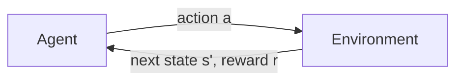

# Lesson 1 — The Language of Reinforcement Learning

> **Goal:** understand what reinforcement learning (RL) problems look like in math,
> and compute the *best possible* behaviour in a tiny world by hand-written code.
>
> **You will learn:** agent, environment, state, action, reward, Markov decision
> process (MDP), return, discount factor, policy, value function, Bellman equations,
> value iteration.
>
> **Time:** about 2 hours. **StarCraft II needed:** no.

---

## 1. The big picture

In reinforcement learning, an **agent** learns by *doing*. Nobody tells it the right
answer. It tries something, sees what happens, and gets a number called a **reward**.
Its job is to collect as much reward as possible over time.



This loop repeats, one **time step** at a time:

1. The agent observes the current **state** $`s_t`$ ("where am I?").
2. It chooses an **action** $`a_t`$ ("what do I do?").
3. The environment moves to a new state $`s_{t+1}`$ and gives a reward $`r_{t+1}`$.

In StarCraft II's *MoveToBeacon* mini-game:

| RL word | MoveToBeacon |
|---|---|
| agent | the program controlling the marine |
| environment | the StarCraft II game |
| state | where the beacon is relative to the marine |
| action | move in one of 8 directions |
| reward | +1 each time the marine reaches the beacon |

---

## 2. Our playground: GridWorld

StarCraft II is slow and complicated. To learn the ideas, we first use a tiny copy of
MoveToBeacon that runs instantly: [`envs/gridworld.py`](../envs/gridworld.py).

```
x →  0 1 2 3 4
y 0  . . . . .       M = marine (starts at x=1, y=2)
↓ 1  . . # . .       B = beacon (x=4, y=4), reward +1, episode ends
  2  . M # . .       # = wall, cannot be entered
  3  . . . . .
  4  . . . . B
```

- **States:** the 23 cells that are not walls.
- **Actions:** up, right, down, left.
- **Rewards:** +1 when the marine steps onto the beacon, 0 otherwise.
- Walking into a wall or the edge means you stay where you are.

---

## 3. A short math refresher

You only need two ideas from probability.

**Probability.** $`P(X = x)`$ is how likely it is that the random quantity $`X`$ takes the
value $`x`$. All probabilities are between 0 and 1 and add up to 1.

**Expected value (average).** If a random quantity $`X`$ takes value $`x`$ with probability
$`P(X=x)`$, its expected value is the probability-weighted average:

```math
\mathbb{E}[X] = \sum_x P(X = x)\, x
```

*Example.* A game pays you 10 with probability 0.2 and 0 with probability 0.8.
Then $`\mathbb{E}[\text{pay}] = 0.2 \times 10 + 0.8 \times 0 = 2`$.
If you played many times, you would earn 2 per game on average.

The symbol $`\sum`$ ("sigma") just means *add up*. For example $`\sum_{k=0}^{2} x_k = x_0 + x_1 + x_2`$.

---

## 4. Markov decision process (MDP)

An RL problem is written down as an **MDP**, which has five ingredients:

| Symbol | Meaning | GridWorld |
|---|---|---|
| $`\mathcal{S}`$ | set of states | 23 cells |
| $`\mathcal{A}`$ | set of actions | up, right, down, left |
| $`p(s', r \mid s, a)`$ | dynamics: how the world responds | moves are deterministic (`slip=0`) |
| $`r`$ | reward | +1 at the beacon |
| $`\gamma`$ | discount factor, $`0 \le \gamma \le 1`$ | 0.9 |

The **dynamics** tell us the probability of landing in state $`s'`$ with reward $`r`$ if we
are in state $`s`$ and take action $`a`$:

```math
p(s', r \mid s, a) = P(S_{t+1} = s',\ R_{t+1} = r \mid S_t = s,\ A_t = a) \qquad (1)
```

Read the bar "$`\mid`$" as "given". In our code, this is the method
`GridWorld.transitions(state, action)`, which returns a list of
`(probability, next_state, reward, done)`.

**The Markov property.** The next state depends only on the *current* state and action,
not on the whole history. "The future depends on the past only through the present."
If you know where the marine is now, knowing how it got there does not help.

---

## 5. Return: what the agent wants to maximise

The agent does not care only about the next reward, but about **all future rewards**.
The **return** $`G_t`$ is the sum of future rewards, each one *discounted* by $`\gamma`$:

```math
G_t = r_{t+1} + \gamma r_{t+2} + \gamma^2 r_{t+3} + \dots = \sum_{k=0}^{\infty} \gamma^k\, r_{t+k+1} \qquad (2)
```

**Why discount?**

- A reward now is worth more than the same reward later (like money).
- It makes the agent prefer **shorter** paths: reaching the beacon in 3 steps gives
  $`\gamma^2 = 0.81`$, in 5 steps gives $`\gamma^4 \approx 0.66`$.
- It keeps the sum finite even if the game never ends.

*Worked example* ($`\gamma = 0.9`$). Rewards after time $`t`$ are $`0, 0, 1`$:
$`G_t = 0 + 0.9 \times 0 + 0.9^2 \times 1 = 0.81`$.

**A very useful trick.** Pull out the first reward, and what is left is $`\gamma`$ times
the next return:

```math
G_t = r_{t+1} + \gamma \left( r_{t+2} + \gamma r_{t+3} + \dots \right) = r_{t+1} + \gamma\, G_{t+1} \qquad (3)
```

"Total future reward = reward now + discounted total future reward from the next step."
Every algorithm in this course is built on this one line.

---

## 6. Policy: how the agent behaves

A **policy** $`\pi`$ is the agent's rule for choosing actions. In general it is a
probability:

```math
\pi(a \mid s) = \text{probability of choosing action } a \text{ in state } s
```

- The **random policy** picks each of the 4 moves with probability $`\frac14`$.
- A **deterministic policy** always picks the same action in a given state,
  like the arrow maps you will see below.

---

## 7. Value functions: how good is a state?

The **state-value function** of policy $`\pi`$ is the expected return when starting in
state $`s`$ and following $`\pi`$ afterwards:

```math
V^\pi(s) = \mathbb{E}_\pi\left[\, G_t \mid S_t = s \,\right] \qquad (4)
```

The **action-value function** is the same, but we first take action $`a`$ and follow
$`\pi`$ afterwards:

```math
Q^\pi(s, a) = \mathbb{E}_\pi\left[\, G_t \mid S_t = s,\ A_t = a \,\right] \qquad (5)
```

Intuition: $`V(s)`$ answers "how good is it to **be here**?", and $`Q(s,a)`$ answers
"how good is it to **do this here**?". By definition the value of a terminal state
(the beacon) is 0, because no more rewards can come after the episode ends.

---

## 8. The Bellman expectation equation

Put Eq. 3 inside Eq. 4:

```math
V^\pi(s) = \mathbb{E}_\pi\left[\, r_{t+1} + \gamma\, G_{t+1} \mid S_t = s \,\right]
```

To compute this expected value, we average over everything random, in order:

1. which action we choose: probability $`\pi(a \mid s)`$,
2. where we land and what reward we get: probability $`p(s', r \mid s, a)`$,
3. what happens afterwards: on average that is $`V^\pi(s')`$ by definition.

This gives the **Bellman expectation equation**:

```math
V^\pi(s) = \sum_{a} \pi(a \mid s) \sum_{s', r} p(s', r \mid s, a) \left[\, r + \gamma\, V^\pi(s') \,\right] \qquad (6)
```

It says: *the value of a state is the average of (reward + discounted value of where
you land)*. The value of one state is written in terms of the values of its neighbours.

### Turning the equation into an algorithm

We do not know $`V^\pi`$ yet, but we can **guess** (all zeros) and then use Eq. 6 as an
update rule: plug the current guess into the right-hand side to get a better guess
on the left. Repeat until nothing changes. This is **iterative policy evaluation**.

▶ **Run it:**

```bash
python 01_rl_basics/policy_evaluation.py
```

```
Converged after 61 sweeps.

V^pi for the RANDOM policy (gamma = 0.9):
 0.018  0.023  0.034  0.061  0.072
 0.023  0.025   ###   0.103  0.115
 0.034  0.042   ###   0.179  0.222
 0.053  0.084  0.172  0.291  0.472
 0.065  0.106  0.217  0.470     B
```

Look at the code in [`policy_evaluation.py`](policy_evaluation.py): the inner loop is
Eq. 6, line by line. Values are larger near the beacon: a randomly walking marine
standing next to the beacon will probably stumble onto it soon.

---

## 9. Optimal values and the Bellman optimality equation

The random policy is bad. What is the **best** we could possibly do?
The optimal value functions are the largest values achievable by any policy:

```math
V^*(s) = \max_\pi V^\pi(s), \qquad Q^*(s,a) = \max_\pi Q^\pi(s,a)
```

If we know $`V^*`$, the value of taking action $`a`$ is one step of look-ahead:

```math
Q^*(s, a) = \sum_{s', r} p(s', r \mid s, a) \left[\, r + \gamma\, V^*(s') \,\right] \qquad (7)
```

The best agent always picks the best action, so instead of *averaging* over actions
(as in Eq. 6) we take the **maximum**. This is the **Bellman optimality equation**:

```math
V^*(s) = \max_{a} \sum_{s', r} p(s', r \mid s, a) \left[\, r + \gamma\, V^*(s') \,\right] \qquad (8)
```

Once we have $`V^*`$, the optimal policy simply picks the action with the highest $`Q^*`$:

```math
\pi^*(s) = \arg\max_a Q^*(s, a) \qquad (9)
```

($`\arg\max_a`$ means "the $`a`$ that gives the largest value".)

### Value iteration

Same trick as before: start from zeros and apply Eq. 8 as an update until it stops
changing. This is **value iteration**.

▶ **Run it:**

```bash
python 01_rl_basics/value_iteration.py
```

```
Converged after 9 sweeps.

V* (gamma = 0.9, slip = 0.0):
 0.478  0.531  0.590  0.656  0.729
 0.531  0.590   ###   0.729  0.810
 0.590  0.656   ###   0.810  0.900
 0.656  0.729  0.810  0.900  1.000
 0.729  0.810  0.900  1.000     B

Optimal policy (B = beacon, # = wall):
> > > > v
> v # > v
> v # > v
> > > > v
> > > > B
```

**Check the math yourself.** From the start cell $`(1, 2)`$ the shortest path to the
beacon takes 5 steps, and the only reward is the +1 on the last step. By Eq. 2 the
return is $`\gamma^4 = 0.9^4 = 0.6561`$, exactly what the table shows. In general, with
deterministic moves, $`V^*(s) = \gamma^{d-1}`$ where $`d`$ is the distance to the beacon.

---

## 10. Experiments

Change one thing at a time and predict the result **before** running.

1. **A slippery floor.** `--slip 0.2`: 20% of the time the marine moves in a random
   direction. What happens to the values? Does the policy change near the wall?
2. **A short-sighted agent.** `--gamma 0.5`. How do far-away values change?
3. **No discounting.** `--gamma 1.0`. What do all the values become, and why is the
   policy table now less useful? (Hint: are all paths equally good?)

<details>
<summary>What you should see in experiment 3</summary>

Every value becomes 1.0 and the "optimal" policy is `^` everywhere, even in the top
row where "up" just bumps into the edge. Without discounting, reaching the beacon in
5 steps or in 5,000 steps is worth the same, so every action ties and the code picks
the first one. Discounting is what makes the agent *hurry*.

</details>

---

## 11. The catch

Both algorithms above use `env.transitions(...)`, the full model
$`p(s', r \mid s, a)`$. This is called **planning**: we computed the answer without ever
playing.

In StarCraft II we have **no such model**. We cannot ask the game for a list of
probabilities; we can only *play* and see what happens. In [Lesson 2](../02_q_learning/)
we remove the model and learn $`Q^*`$ from experience alone. That is **Q-learning**.

---

## 12. Exercises

1. Compute $`G_0`$ by hand for rewards $`r_1, r_2, r_3 = 0, 0, 1`$ with $`\gamma = 0.5`$.
2. Using Eq. 6, write out $`V^\pi`$ for the cell just above the beacon $`(4, 3)`$ under
   the random policy. Which neighbour values appear?
3. Why is $`V^*`$ in the top-right corner $`(4, 0)`$ equal to $`0.729`$?
4. In `value_iteration.py`, replace `max(...)` in Eq. 8 with the average over actions.
   Which algorithm did you just rebuild?

<details>
<summary>Answers</summary>

1. $`G_0 = 0 + 0.5 \times 0 + 0.5^2 \times 1 = 0.25`$.
2. Each action has probability $`\frac14`$. Up goes to $`(4,2)`$, left goes to $`(3,3)`$,
   right hits the edge and stays at $`(4,3)`$, down reaches the beacon with reward 1 and
   the episode ends. So
   $`V(4,3) = \frac14\left[\gamma V(4,2)\right] + \frac14\left[\gamma V(4,3)\right] + \frac14\left[1\right] + \frac14\left[\gamma V(3,3)\right]`$.
   Note that $`V(4,3)`$ appears on both sides; the iteration takes care of that.
3. It is 4 steps away from the beacon, so $`\gamma^{3} = 0.9^3 = 0.729`$.
4. Policy evaluation of the random policy (Eq. 6 with $`\pi(a \mid s) = \frac14`$).

</details>

---

## Summary

| Symbol | Name | One-line meaning |
|---|---|---|
| $`s, a, r`$ | state, action, reward | where I am, what I do, what I get |
| $`\gamma`$ | discount factor | how much the future matters |
| $`G_t`$ | return | discounted sum of future rewards (Eq. 2) |
| $`\pi(a \mid s)`$ | policy | how the agent chooses actions |
| $`V^\pi(s)`$ | state value | expected return from $`s`$ under $`\pi`$ (Eq. 4) |
| $`Q^\pi(s,a)`$ | action value | expected return after doing $`a`$ in $`s`$ (Eq. 5) |
| Eq. 6 | Bellman expectation | value = average of (reward + $`\gamma`$ · next value) |
| Eq. 8 | Bellman optimality | value = **max** over actions of the same thing |

**Further reading:** Sutton & Barto, *Reinforcement Learning: An Introduction* (2nd ed.),
chapters 3–4. The book is free online at <http://incompleteideas.net/book/the-book-2nd.html>.

**Next:** [Lesson 2 — Q-learning in StarCraft II →](../02_q_learning/)
