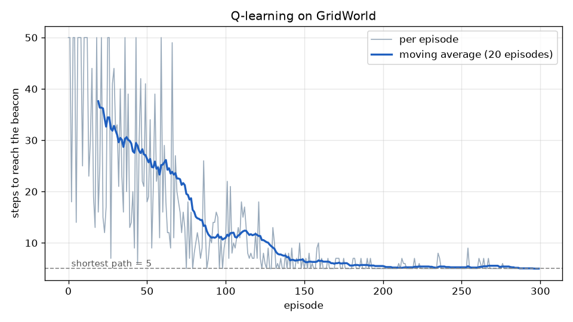
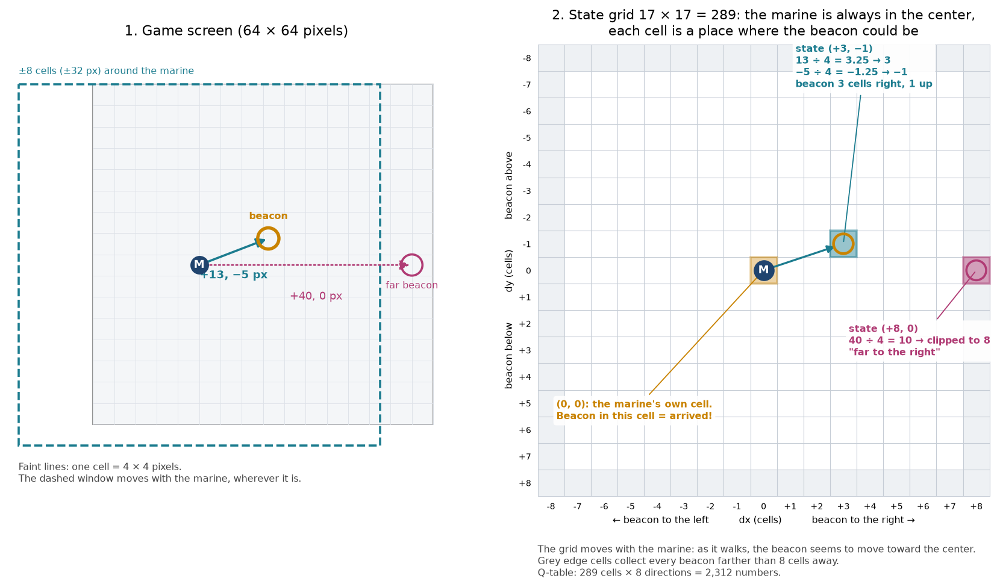
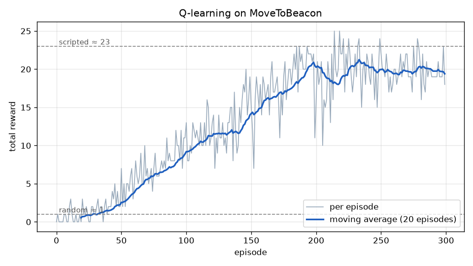
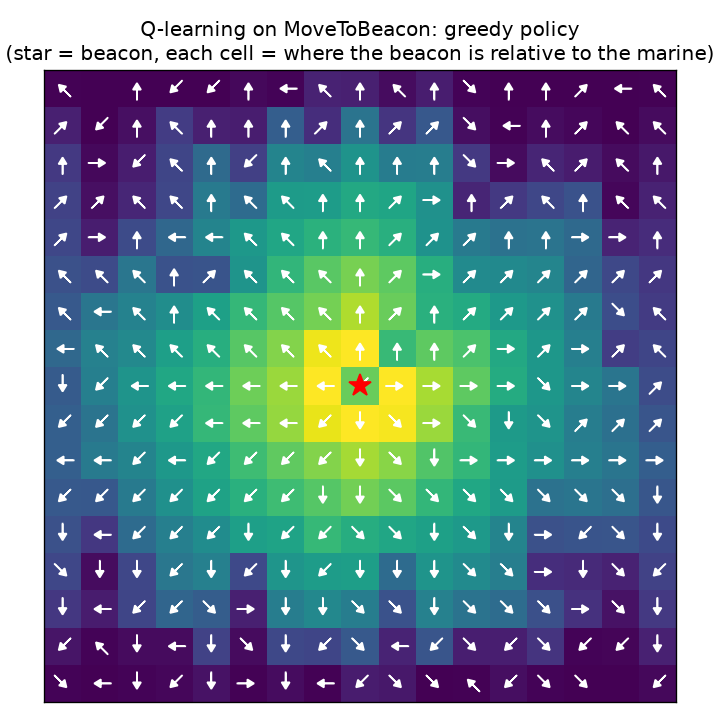

# Lesson 2 — Learning from Experience: Q-learning

> **Goal:** learn the optimal action values $`Q^*`$ **without** a model of the world,
> just by playing, and use them to control a marine in StarCraft II.
>
> **You will learn:** sample averages, temporal-difference (TD) learning, the
> Q-learning update, exploration vs exploitation, $`\varepsilon`$-greedy, designing
> states for a real game, state aliasing.
>
> **Time:** about 2–3 hours. **StarCraft II needed:** yes (from section 7).

> **New to this? Warm up first.** The walkthrough runs Q-learning on a 4-cell corridor and
> prints every update, so you can follow each number by hand. It runs in your browser,
> with nothing to install:
>
> [](https://colab.research.google.com/github/ucmoprj/RL_starcraft/blob/main/02_q_learning/walkthrough.ipynb)
>
> Or locally: `python 02_q_learning/walkthrough.py --stage 1` (then `--stage 2`).
>
> **Prefer to watch it?** Open the **[Q-Learning Lab](https://ucmoprj.github.io/RL_starcraft/02_q_learning/q_learning_lab.html)**
> in your browser. It is also in this folder as [`q_learning_lab.html`](q_learning_lab.html) if you want to use it offline.
> You press *Step* and watch the marine move. Every update is shown as a formula
> with the real numbers filled in, and a log records each calculation. It covers the same corridor and the
> 5 × 5 GridWorld used below.

---

## 1. Where we are

In [Lesson 1](../01_rl_basics/) we computed the optimal policy with value iteration.
It needed the model $`p(s', r \mid s, a)`$: a full list of what can happen after every
action. StarCraft II gives us no such list. All we can do is:

```python
next_state, reward, done = env.step(action)
```

We get **one sample** of what can happen, not the probabilities. Can we still find
the optimal policy? Yes, and the idea is surprisingly simple.

---

## 2. Idea 1: averages can be learned one sample at a time

Suppose you want the average of numbers $`x_1, x_2, x_3, \dots`$ that arrive one by one,
and you do not want to store them all. Let $`\bar{x}_n`$ be the average of the first $`n`$.
A little algebra gives:

```math
\bar{x}_n = \bar{x}_{n-1} + \frac{1}{n}\left( x_n - \bar{x}_{n-1} \right) \qquad (1)
```

*Example.* Numbers 4, 8, 6. Start with $`\bar{x}_1 = 4`$.
Then $`\bar{x}_2 = 4 + \frac12(8 - 4) = 6`$, and $`\bar{x}_3 = 6 + \frac13(6 - 6) = 6`$. ✔

Read Eq. 1 as:

```math
\text{new estimate} = \text{old estimate} + \text{step size} \times \left( \text{target} - \text{old estimate} \right)
```

The part in brackets is the **error**: how wrong our estimate was on this sample.
We move the estimate a little bit toward the new sample. In RL we usually replace
$`\frac{1}{n}`$ by a small constant $`\alpha`$ (the **learning rate**), which gives more
weight to recent samples. That is useful because, as we will see, our targets
improve over time.

---

## 3. Idea 2: the Bellman equation is an average we can sample

From Lesson 1 (Eq. 7 and Eq. 8), the optimal action values satisfy:

```math
Q^*(s, a) = \sum_{s', r} p(s', r \mid s, a) \left[\, r + \gamma \max_{a'} Q^*(s', a') \,\right] \qquad (2)
```

The right-hand side is an **expected value** (a probability-weighted average) of the
quantity in brackets. We cannot compute the sum without $`p`$, but every time we play
action $`a`$ in state $`s`$, the game hands us one sample $`(r, s')`$ drawn from exactly
that distribution $`p(s', r \mid s, a)`$.

So we can average the samples with Eq. 1. That is all Q-learning is.

---

## 4. The Q-learning update

After each step $`(s, a, r, s')`$, compute the **TD target** (our one-sample guess of
the right-hand side of Eq. 2) and the **TD error** (how far off we were):

```math
y = r + \gamma \max_{a'} Q(s', a'), \qquad \delta = y - Q(s, a) \qquad (3)
```

Then move $`Q(s,a)`$ a small step toward the target, exactly like Eq. 1:

```math
Q(s, a) \leftarrow Q(s, a) + \alpha\, \delta \qquad (4)
```

If $`s'`$ is a **terminal** state, nothing comes after it, so $`y = r`$.

In [`q_learning.py`](q_learning.py):

```python
future = 0.0 if terminal else np.max(self.Q[next_state])
td_target = reward + self.gamma * future                      # Eq. 3
td_error = td_target - self.Q[state][action]                  # Eq. 3
self.Q[state][action] += self.alpha * td_error                # Eq. 4
```

**Learning a guess from a guess.** Notice that the target $`y`$ uses $`Q(s', \cdot)`$,
which is itself only an estimate. This is called **bootstrapping**. At first all
estimates are 0 and only the step that reaches the beacon gets a real signal
($`r = 1`$). On later episodes that value flows backwards, one step at a time, to the
states before it. Section 6 shows this happening.

The name **temporal-difference (TD)** learning comes from the TD error $`\delta`$: it is
the difference between two estimates at successive time steps.

### Worked example: three episodes in a corridor

Take the smallest possible world: cells 0, 1, 2 and the beacon B, with the marine
always walking right. Use $`\alpha = 0.5`$ and $`\gamma = 0.9`$. Each step updates the
$`Q`$ of the cell the marine **leaves**, using the **current** value of the cell it
arrives in:

| Step | Target $`y`$ (Eq. 3) | New $`Q`$ (Eq. 4) |
|---|---|---|
| *Episode 1* | | |
| 0 → 1 | $`0 + 0.9 \times 0 = 0`$ | $`Q(0) = 0`$ |
| 1 → 2 | $`0 + 0.9 \times 0 = 0`$ | $`Q(1) = 0`$ |
| 2 → B | $`1`$ (terminal) | $`Q(2) = 0 + 0.5 \times (1 - 0) = 0.5`$ |
| *Episode 2* | | |
| 0 → 1 | $`0 + 0.9 \times 0 = 0`$ | $`Q(0) = 0`$ |
| 1 → 2 | $`0 + 0.9 \times 0.5 = 0.45`$ | $`Q(1) = 0 + 0.5 \times 0.45 = 0.225`$ |
| 2 → B | $`1`$ | $`Q(2) = 0.5 + 0.5 \times 0.5 = 0.75`$ |
| *Episode 3* | | |
| 0 → 1 | $`0 + 0.9 \times 0.225 = 0.2025`$ | $`Q(0) = 0.101`$ |
| 1 → 2 | $`0 + 0.9 \times 0.75 = 0.675`$ | $`Q(1) = 0.45`$ |
| 2 → B | $`1`$ | $`Q(2) = 0.875`$ |

Three things to notice:

- **The value moves back one cell per episode.** In episode 2, cell 0 is updated
  *before* cell 1 has learned anything, so cell 0 has to wait for episode 3.
- **The target borrows the next cell's value, not its reward.** Cell 1 never receives
  a reward itself. Its target uses $`Q(2)`$, which already summarises everything that
  comes after cell 2. That is the Bellman equation (Eq. 2) at work.
- **Reaching the beacon gives 0.5, not 1.** That halving comes from $`\alpha`$, not
  $`\gamma`$. The step ended the episode, so there is no $`\gamma`$ term at all.
  Question 2 in section 11 explains the difference.

The values stop at $`Q(2) = 1`$, $`Q(1) = 0.9`$, $`Q(0) = 0.81`$ (section 11, question 4).

---

## 5. Exploration vs exploitation

If the agent always picks the action with the highest current $`Q`$ (**exploitation**),
it gets stuck: early on, all values are 0, and it will never try the actions that
might turn out to be better. It must sometimes try other actions (**exploration**).

The simplest fix is **$`\varepsilon`$-greedy**:

```math
a =
\begin{cases}
\text{a random action} & \text{with probability } \varepsilon \\
\arg\max_{a} Q(s, a) & \text{with probability } 1 - \varepsilon
\end{cases} \qquad (5)
```

We start with $`\varepsilon = 1`$ (explore all the time) and lower it linearly to
$`0.05`$ over the first 60% of training (`linear_schedule` in the code). When several
actions tie for the best value, we pick one of them at random.

**Off-policy.** The agent *behaves* $`\varepsilon`$-greedily, but the $`\max`$ in Eq. 3
means it *learns about* the greedy policy. Learning about one policy while following
another is called **off-policy** learning. It is why Q-learning can explore freely
and still learn the optimal values.

---

## 6. The whole algorithm, and a first test in GridWorld

```
Initialise Q(s, a) = 0 for all s, a
For each episode:
    s = env.reset()
    Until the episode ends:
        choose a with ε-greedy (Eq. 5)
        s', r, done = env.step(a)
        δ = r + γ max_a' Q(s', a') − Q(s, a)     (Eq. 3; just r if s' is terminal)
        Q(s, a) ← Q(s, a) + α δ                   (Eq. 4)
        s = s'
```

▶ **Run it** (a few seconds, no StarCraft needed):

```bash
python 02_q_learning/q_learning.py --env gridworld
```

```
episode   50 | epsilon 0.74 | avg reward   0.68 | avg steps   32.1
episode  100 | epsilon 0.48 | avg reward   1.00 | avg steps   15.9
episode  150 | epsilon 0.21 | avg reward   1.00 | avg steps    8.9
episode  200 | epsilon 0.05 | avg reward   1.00 | avg steps    5.7
episode  250 | epsilon 0.05 | avg reward   1.00 | avg steps    5.3
episode  300 | epsilon 0.05 | avg reward   1.00 | avg steps    5.2

Learned greedy policy (compare with Lesson 1's value iteration):
v v > v <
> v # v v
> v # v <
v v v v v
> > > > B
```



The number of steps drops from about 32 (mostly random) to about 5, the length of the
shortest path. The last few episodes are slightly above 5 because $`\varepsilon = 0.05`$
still makes a random move now and then.

**Compare with value iteration.** The policy is not identical to Lesson 1's. Along
the paths the agent actually uses, it is optimal. But look at the top-right corner:
`<` means "go left", which is not the shortest way. The marine almost never visits
that corner, so the agent never learned much about it. **Q-learning only knows about
what it has experienced.** Value iteration, with the full model, knew everything.

**Four numbers per cell, but only one has to be right.** Each cell holds a $`Q`$ for
up, right, down and left (23 cells × 4 = 92 numbers). To walk to the beacon, the agent
only needs the *best* direction to have the *highest* number in the cells it passes.
The other three can stay rough, or even stay at 0.

**Why does it keep taking the same path?** The first route that reaches the beacon
gets its values raised first. From then on the greedy choice prefers that route, and
the other routes stay at 0 because they are never tried. With $`\varepsilon = 0.05`$ the
agent only strays one step at a time and comes back. It rarely tries a whole different
route. That is exploitation at work. With $`\varepsilon = 1`$ every cell and direction
gets filled in.

**Nobody told it to find the shortest path.** The only reward is +1 at the beacon.
But every extra step multiplies the value by $`\gamma`$ once more: $`1, 0.9, 0.81, 0.73, \dots`$.
So a shorter route always has a higher value, and maximising reward *becomes*
finding a shortest path. Humans define **what** is good (the reward). The agent works
out **how** to get it.

---

## 7. Moving to StarCraft II: designing the state

The PySC2 game gives us images with many layers and hundreds of possible actions.
A table cannot handle that, so the wrapper [`envs/move_to_beacon.py`](../envs/move_to_beacon.py)
builds a small state and action set for us. These are *design choices*, and they
matter as much as the algorithm.

**Actions.** 8 directions. Each action orders the marine to walk 8 pixels that way.

**State.** Where is the beacon *relative to* the marine? We take the offset
(beacon − marine) in screen pixels, divide it into cells of 4 × 4 pixels, and clip it
to at most 8 cells in each direction. That gives $`17 \times 17 = 289`$ states, and
the Q-table has $`289 \times 8 = 2312`$ numbers.



**Picture the marine always in the centre of the grid.** Each of the 289 cells is a
place where the beacon could be, *as seen from the marine*. The offset is always
computed as (beacon − marine). So the **sign** tells the direction and the
**size** tells the distance: $`(+3, 0)`$ means "3 cells to my right" and $`(-3, 0)`$
means "3 cells to my left". Screen $`y`$ grows downwards, so a negative $`dy`$ means
"above". Beacons farther than 8 cells all land on the edge of the grid ("far away,
that way"). As the marine walks, the grid moves with it, so the beacon seems to slide
toward the centre. When the beacon reaches the centre cell, the marine has arrived.

Using the **relative** position is a good trick: "the beacon is 3 cells to the
right" needs the same action no matter where on the map the marine stands, so the
agent learns once and reuses it everywhere.

This is also why the beacon can jump to a new random place after every touch
without the agent having to relearn anything. A marine at (10, 10) with the beacon at
(22, 10) and a marine at (40, 30) with the beacon at (52, 30) are the **same state**,
$`(+3, 0)`$, and use the same row of the table. Compare GridWorld: its state is only
the marine's position, so if you moved the beacon there, every learned value would
be wrong and training would have to start over. **What you put in the state decides
what the agent can reuse.**

**Reward.** +1 every time the marine touches the beacon. The beacon then jumps to a
random new place. An episode lasts 120 game seconds (about 240 steps).

### A lesson from building this: state aliasing

The first version of the wrapper used **8-pixel** cells. Even a hand-written
"always walk toward the beacon" policy scored almost nothing. Printing the positions
showed why: the marine stood 4 pixels from the beacon, which rounds to the cell
"offset (0, 0)", the same state as *standing on* the beacon. The state could not tell
"I am on the beacon" apart from "the beacon is right next to me", so no policy could
choose correctly. When two different situations that need different actions look
like the same state, it is called **state aliasing**. With 4-pixel cells the
scripted policy scores about 23 per episode.

### Terminal states in MoveToBeacon

The game episode does not end when the beacon is reached; the beacon just moves.
But the next beacon position is random and has nothing to do with the action we
took. So for learning we treat "reached the beacon" as the end of a sub-task:
$`y = r = 1`$ with no future term (`terminal_on_reward=True` in the code).

The 120-second time limit is **not** a terminal state. The marine did nothing wrong
there; the clock just ran out. We do not cut the future off at a time-out.

---

## 8. Q-learning in StarCraft II

▶ **Run it** (about 6–7 minutes; the game window opens but the agent plays at full speed):

```bash
python 02_q_learning/q_learning.py --env sc2 --episodes 300
```
```
episode   10 | epsilon 0.95 | avg reward   0.30 | avg steps  239.0
episode   50 | epsilon 0.74 | avg reward   2.80 | avg steps  239.0
episode  100 | epsilon 0.48 | avg reward   9.70 | avg steps  239.0
episode  150 | epsilon 0.21 | avg reward  15.80 | avg steps  239.0
episode  200 | epsilon 0.05 | avg reward  20.30 | avg steps  239.0
episode  250 | epsilon 0.05 | avg reward  19.50 | avg steps  239.0
episode  300 | epsilon 0.05 | avg reward  19.50 | avg steps  239.0
```

(Your numbers will differ a little: the beacon positions are random.)



The marine starts at about 1 beacon per episode (random) and reaches about 20, close
to the hand-written "walk straight to the beacon" policy (about 23). Nobody told the
agent where to go. It learned it from the +1 rewards alone.

**Reading the policy map.**



Each cell is a **state**: where the beacon is relative to the marine. The red star in
the middle means "the beacon is right here". The cell three to the right of the star
means "the beacon is 3 cells to my right", and its arrow says what the agent does
there. The arrows point **away from the centre**, which is correct: if the beacon is
to your right, walk right. The colour is $`\max_a Q(s, a)`$: bright near the centre
(the reward is close), dark far away (the reward is many discounted steps away, as
$`\gamma^{d}`$ in Lesson 1).

Near the edges the arrows are messier. Those states are visited less often, the same
effect as the top-right corner of GridWorld.

Why not 23? With $`\varepsilon = 0.05`$ the agent still takes a random step now and
then, and the state is coarse (4-pixel cells), so it sometimes zig-zags. Experiment 4
in section 9 explores the state size.

▶ **Watch the trained marine** at human speed:

```bash
python 02_q_learning/watch.py
python 02_q_learning/watch.py --random     # for comparison
python 02_q_learning/watch.py --grid       # draw the state grid and Q values on the game
python 02_q_learning/watch.py --show-q     # plus a live window: state grid and Q bar chart
```

With `--grid`, the 17 × 17 state grid is painted into the game around the marine,
using StarCraft II's debug-draw feature. It is drawn only for you: the agent's
observations do not change. The grid moves with the marine, because the state is
relative to it. The orange box is the beacon's cell (the current state). The 8 numbers
around the marine are $`Q(s, \cdot)`$, and the chosen one is in green. Far from the
beacon the numbers are close to 0: those states were rarely visited, so the table
knows little about them (section 10).

### What you are watching, and who does what

`watch.py` does no learning. The values were all computed during training and saved
to `results/sc2_q_table.npy`. Each step, it only looks them up:

```
repeat about 240 times:
  1. state  = where is the beacon, relative to the marine?     envs/move_to_beacon.py, _state()
  2. action = argmax of Q[state]  (the highest of 8 numbers)    watch.py
  3. order  = "move to the point 8 pixels that way"             envs/move_to_beacon.py, step()
  4. the game runs for about 0.36 s; read the reward and the new positions
```

The small **green markers** that flash just ahead of the marine are these move orders.
Each one is where the marine was told to walk, so each one shows the direction it
picked from its $`Q`$-table. With `--random` they scatter in every direction.

The work is split between three parties:

| Part | Made by | Role |
|---|---|---|
| StarCraft II and the MoveToBeacon map | Blizzard, DeepMind | the world: moves units, gives rewards |
| PySC2 | DeepMind | the connection: launches the game, reports what is on screen, sends orders |
| `q_learning.py`, `watch.py`, `envs/` | this course | the brain: learns $`Q`$ and picks actions |

PySC2 contains **no learning algorithm**. Its `pysc2/agents/` folder only has example
agents that do not learn. One picks random actions. Another follows rules a human wrote:
the MoveToBeacon one simply orders "move to the beacon". Those are the two reference
lines in the learning curve above (random ≈ 1, scripted ≈ 23). Our agent starts
without knowing the answer and gets close to the hand-written rule.

---

## 9. Experiments

Change one thing at a time. Predict first, then run.

1. **Learning rate.** `--alpha 0.5` and `--alpha 0.01`. Which learns faster at first?
   Which ends up more stable?
2. **Discount.** `--gamma 0.5` and `--gamma 0.99` in GridWorld. Look at the policy map
   in `results/gridworld_policy.png`.
3. **Always explore / never explore.** In `train(...)`, set `eps_start=eps_end=1.0`,
   then `eps_start=eps_end=0.0`. What happens in each case, and why?
4. **State aliasing.** Create the environment with `MoveToBeaconEnv(cell_pixels=8, radius=4)`
   and train again. Does the score match section 7's story?

---

## 10. The limit of tables

Our table has one number per (state, action). That worked because we squeezed the
game into 289 states by hand. For real StarCraft screens, $`84 \times 84`$ images with
many layers, the number of possible states is astronomically large; a table is
impossible, and the agent could never visit each state even once.

| State design | States | Q-table | Just visiting each (state, action) once* |
|---|---|---|---|
| relative offset, 17 × 17 (this lesson) | 289 | 2,312 numbers, ~18 KB | seconds |
| absolute marine + beacon positions on a 64 × 64 screen | $`64^4 \approx 16.8`$ million | ~134 million numbers, ~1 GB | ~8 days |
| one 84 × 84 on/off screen layer | $`2^{7056}`$ | impossible | impossible |

\* At the ~185 steps per second of our training run.

Memory is not the first thing to run out. **Experience** is. A table cell learns only
when it is visited, and nothing it learns carries over to its neighbours.

**Obstacles break the relative-state trick.** MoveToBeacon is an empty field, so
"beacon to the right → go right" is always correct. On a real map, the state
$`(+3, 0)`$ could mean open ground in one place and a wall in between somewhere else.
Both places share one row of the table, so that row learns an average that is right
for neither. This is state aliasing again. Adding the nearby terrain to the state
multiplies the table: just "is each of the 8 neighbours blocked?" gives
$`289 \times 2^8 = 73{,}984`$ states. PySC2's list of currently available actions can
rule out impossible moves (action masking). But it cannot teach the agent to go
*around* a wall.

We need a function that **generalises**: something that, having learned about one
state, can guess the value of similar states it has never seen. A neural network can
do that. Replacing the table with a network gives **Deep Q-Networks (DQN)**, the
topic of Lesson 3. The network sees the whole screen, terrain included. Q-learning's
target (Eq. 3) stays exactly the same.

---

## 11. Questions learners ask

These came up while people worked through this lesson. Try to answer each one
yourself before opening it.

<details>
<summary><b>1. Is Q the reward? Is it a probability?</b></summary>

Neither. The **reward** $`r`$ is a fact: the game (really, whoever designed it) hands
it over after a step. $`Q(s,a)`$ is the agent's **guess** of the total discounted reward
it will collect from now on if it takes $`a`$ in $`s`$ (Eq. 2).

In MoveToBeacon it happens to stay between 0 and 1, which makes it look like a
probability. Change the rules and it will not. With a beacon worth +10, $`Q`$ reaches
10. With a −0.01 penalty per step, far states go negative. In the full 120-second game
the marine collects many +1s. Probability enters only through the averaging: if a
move gives 10 with probability 0.8 and 0 otherwise, then $`Q = 0.8 \times 10 = 8`$. That is
an expected reward, not a probability.
</details>

<details>
<summary><b>2. The marine reached the beacon and got reward 1, but Q became 0.5. Was that the discount?</b></summary>

No, it was the learning rate. Test it: change $`\gamma`$ to 0.99, 0.5 or 0.1 and the first
update is still 0.5. Change $`\alpha`$ to 1.0 or 0.1 and it becomes 1.0 or 0.1.

$`\gamma`$ discounts rewards that arrive **later**. This reward arrived on this very
step, and the episode ended, so $`y = r = 1`$ with no $`\gamma`$ term. $`\alpha = 0.5`$
then moved $`Q`$ only halfway from 0 toward 1. Repeat it and $`Q`$ goes
0.5 → 0.75 → 0.875 → … → 1. It ends at **1**, not 0.9, which confirms that nothing was
discounted. Also note *which* number changed. It was $`Q(\text{cell } 2, \text{right})`$,
not "cell 2" as a whole: going left from cell 2 would not have earned that reward.
</details>

<details>
<summary><b>3. What is the difference between α and γ?</b></summary>

```math
Q(s,a) \leftarrow Q(s,a) + \underbrace{\alpha}_{\text{how far to move}} \Big[\, \underbrace{r + \gamma \max_{a'} Q(s',a')}_{\text{where to move to}} - Q(s,a) \,\Big]
```

| | $`\gamma`$ (discount) | $`\alpha`$ (learning rate) |
|---|---|---|
| decides | **what** is learned: the target | **how fast** it is learned |
| changing it changes | the final values | only the speed of getting there |
| large value | far-sighted | fast but jumpy when outcomes are random |
| small value | short-sighted | slow but stable |

In the corridor the final values are 0.81, 0.9, 1.0 with $`\gamma = 0.9`$, and
0.25, 0.5, 1.0 with $`\gamma = 0.5`$. Changing $`\alpha`$ gives the same final values,
reached faster or slower.
</details>

<details>
<summary><b>4. Why do the values eventually stop changing?</b></summary>

An update moves $`Q`$ by $`\alpha \times (y - Q)`$. Once every target equals the current
value, the error is 0 and nothing moves. In the corridor that happens at
$`Q(2) = 1`$, $`Q(1) = 0 + 0.9 \times 1 = 0.9`$, $`Q(0) = 0 + 0.9 \times 0.9 = 0.81`$. At that point
"value here = reward + $`\gamma`$ × value of the next state" holds everywhere. That is
the Bellman equation (Eq. 2), and its solution is $`Q^*`$, the same values value iteration
computed in Lesson 1. Q-learning got there with no model, just by walking around.

Strictly, with $`\alpha = 0.5`$ each update closes half the remaining gap, so the
values only approach their limit. After about ten updates the gap is below 0.001.
When outcomes are random, as in StarCraft, the targets keep varying and the values
keep jiggling. That is why the theory lets $`\alpha`$ shrink over time (the
"For the curious" note below).
</details>

<details>
<summary><b>5. Is α the same thing as the step size in gradient descent?</b></summary>

Yes. Measure how wrong a guess is with the squared error, treating the target $`y`$ as a
fixed number:

```math
L = \tfrac{1}{2}\big(y - Q(s,a)\big)^2, \qquad
Q(s,a) \leftarrow Q(s,a) - \alpha \frac{\partial L}{\partial Q(s,a)} = Q(s,a) + \alpha\big(y - Q(s,a)\big) \qquad (6)
```

One gradient-descent step on this loss is exactly the Q-learning update (Eq. 4). It is
called a *semi-gradient*, because $`y`$ also depends on $`Q`$ but we do not differentiate
through it. DQN (Lesson 3) takes the same loss and the same step. It applies them to the
weights of a neural network instead of one table entry, and $`\alpha`$ becomes the
optimiser's learning rate.
</details>

<details>
<summary><b>6. Is a Q-table entry a "weight"?</b></summary>

It is the parameter being learned, so in that sense yes. But in a table the number
**is** the value: changing $`Q(\text{cell } 2, \text{right})`$ changes that one value
and nothing else. In a neural network, the weights are ingredients from which values
are **computed**. Changing one weight shifts the values of many similar states at once.
That sharing is what "generalisation" means, and it is what a table lacks.
</details>

<details>
<summary><b>7. Does a bad move lower its Q-value?</b></summary>

An update raises $`Q`$ when the target is above it and lowers it when the target is
below it. In our examples, all rewards are 0 or +1 and the world is deterministic. So
values start at 0 and only ever rise. Bad moves are not pushed down; they just rise
*less* than good ones. The choice is a comparison: "down" wins because 1.0 > 0.9, not
because "right" was punished. Values do go down when there are penalties (e.g. −0.01
per step, or losing a unit), when outcomes are random, or when a value was
over-estimated earlier.
</details>

<details>
<summary><b>8. Who decides what a "good" action is?</b></summary>

Whoever defines the reward. The agent only maximises the rewards it is given.

| Mini-game | Reward | What "good" turns out to mean |
|---|---|---|
| MoveToBeacon | +1 per beacon | reach beacons fast |
| CollectMineralShards | +1 per shard | pick shards up in an efficient order |
| DefeatRoaches | +10 per roach killed, −1 per marine lost | win fights without losing units |
| full 1v1 game | +1 win, −1 loss | win, with the reward thousands of steps away |

A badly chosen reward gets optimised just as faithfully. A well-known boat-racing
agent was rewarded for hitting targets on the track. It learned to circle and collect
them forever instead of finishing the race. Designing the reward matters as much as
designing the state.
</details>

---

## 12. Exercises

1. Starting with all $`Q = 0`$, $`\alpha = 0.1`$, $`\gamma = 0.9`$: the agent is in state $`s`$,
   takes action $`a`$, gets $`r = 1`$ and reaches a terminal state. What is $`Q(s,a)`$ after
   the update? And after the same thing happens a second time?
2. Now the agent is in $`s_0`$, takes $`a_0`$, gets $`r = 0`$ and lands in the $`s`$ from
   exercise 1 (after the second update). All other values are still 0. What is the
   new $`Q(s_0, a_0)`$?
3. In exercise 2, the value "flowed" from $`s`$ back to $`s_0`$. How many episodes are
   needed, at the very least, for any value to reach the start state of GridWorld,
   5 steps from the beacon?
4. Why does Eq. 3 use $`\max_{a'} Q(s', a')`$ and not the $`Q`$ of the action the agent
   actually takes next?

<details>
<summary>Answers</summary>

1. First: $`\delta = 1 - 0 = 1`$, so $`Q = 0 + 0.1 \times 1 = 0.1`$.
   Second: $`\delta = 1 - 0.1 = 0.9`$, so $`Q = 0.1 + 0.1 \times 0.9 = 0.19`$.
   Each time, $`Q`$ moves 10% of the remaining way toward 1.
2. $`y = 0 + 0.9 \times 0.19 = 0.171`$, $`\delta = 0.171`$, so $`Q(s_0,a_0) = 0.0171`$.
3. At least 5. In each episode, value can move back by one step along the path
   (the update happens when you *leave* a state, using the next state's value as it
   is at that moment). This is one reason Q-learning can be slow when rewards are
   rare.
4. Because we want $`Q^*`$, the value of acting **optimally** from $`s'`$ onwards (Eq. 2),
   not the value of our exploring behaviour. Using the action actually taken gives a
   different algorithm called **SARSA**, which learns the value of the
   $`\varepsilon`$-greedy policy itself (on-policy).

</details>

---

## Summary

| Idea | Equation | In one line |
|---|---|---|
| incremental average | Eq. 1 | estimate += step · (sample − estimate) |
| TD target / TD error | Eq. 3 | $`y = r + \gamma \max Q(s',\cdot)`$, $`\delta = y - Q(s,a)`$ |
| Q-learning update | Eq. 4 | $`Q(s,a) \mathrel{+}= \alpha \delta`$ |
| $`\varepsilon`$-greedy | Eq. 5 | random with probability $`\varepsilon`$, else best |
| update as gradient descent | Eq. 6 | $`\alpha`$ is the step size on $`\tfrac12(y - Q)^2`$ |

**For the curious.** Tabular Q-learning is proven to converge to $`Q^*`$ if every
(state, action) pair is tried infinitely often and the learning rate shrinks in the
right way ($`\sum_t \alpha_t = \infty`$ and $`\sum_t \alpha_t^2 \lt \infty`$). See
Sutton & Barto, chapter 6.5.

**Further reading:** Sutton & Barto, chapter 6 (Temporal-difference learning).

**Previous:** [← Lesson 1](../01_rl_basics/) · **Next:** Lesson 3 — Deep Q-networks (coming soon)
