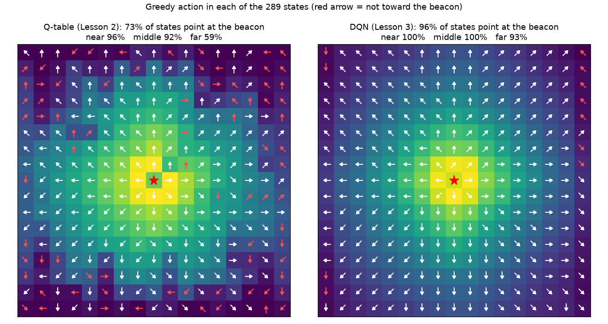
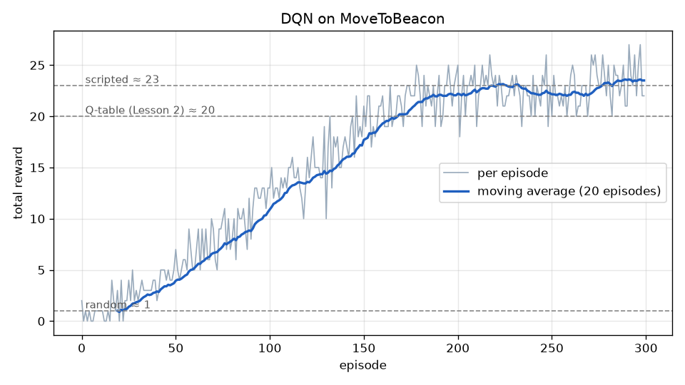
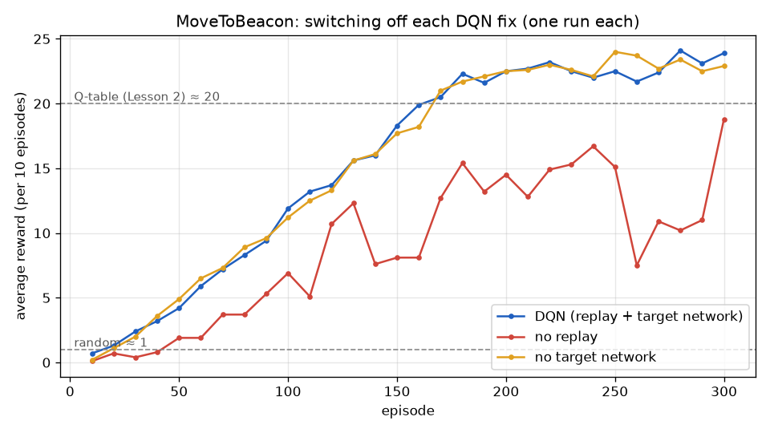

# Lesson 3 — Deep Q-Networks (DQN)

> **Goal:** replace Lesson 2's Q-table with a small neural network, see what that buys
> us (and what it costs), and add the two tricks that make it train reliably.
>
> **You will learn:** function approximation, generalisation, the DQN loss, experience
> replay, target networks, and how to compare two agents fairly.
>
> **Time:** about 2–3 hours. **StarCraft II needed:** yes (from section 9).
> **New Python package:** PyTorch, already installed in [Lesson 0](../00_setup/).

> **Warm up first.** One update on a table changes one number. One update on a
> function changes all of them. See it with real numbers:
>
> ```bash
> python 03_dqn/walkthrough.py --stage 1   # one update: table vs function
> python 03_dqn/walkthrough.py --stage 2   # train on 3 cells, what does it guess for the rest?
> ```

---

## 1. Where we are

Lesson 2's Q-table learned MoveToBeacon well: about 20 beacons per episode. But it
only knows the states it visited often. When you watched it with `--grid`, the Q values
far from the beacon were close to 0, and its choices there were close to random.

Here is every one of the 289 states, with the table's greedy action. A red arrow does
not point toward the beacon:



On the left (Lesson 2's table), 96% of the states near the beacon are right, but only
59% of the far ones. The far states are rarely visited, and **a table cannot use what it
learned in one cell to guess another**. On the right is what this lesson builds.

---

## 2. Idea: a function instead of a table

A table stores one number per (state, action). A **function** computes the number
from the state, using a few parameters $`\theta`$ that are shared by all states:

```math
Q(s, a; \theta) \approx Q^*(s, a) \qquad (1)
```

For MoveToBeacon we give the function exactly the same information the table used,
the beacon's offset in cells. But we give it as **two numbers** instead of a row number:

```
table   : state (11, 7)  →  row 11, column 7 of a 17 × 17 × 8 array
network : state (11, 7)  →  x = (dx / 8, dy / 8) = (0.375, −0.125)
                            → [64 neurons] → [64 neurons] → 8 Q values
```

(`to_input` and `QNetwork` in [`dqn.py`](dqn.py).) Nothing else about the problem
changed: same states, same actions, same rewards, same $`\gamma = 0.9`$. Any difference
in the results comes from the representation alone.

Why does this help? Row 11 and row 12 of a table have nothing to do with each other.
But $`(0.375, -0.125)`$ and $`(0.5, -0.125)`$ are close numbers, and a network maps close
inputs to similar outputs. What it learns about "beacon 3 cells right" **spills over**
to "beacon 4 cells right". That spill-over is called **generalisation**.

---

## 3. Learning a function: the same target, a gradient step

The target is exactly Lesson 2's (Eq. 3 there). What changes is how we move toward it.
We cannot "set a table cell" any more; we can only nudge $`\theta`$. Lesson 2 already
showed the recipe (its Eq. 6): measure the error with a squared loss, then take a
gradient-descent step:

```math
L(\theta) = \tfrac12 \big(y - Q(s,a;\theta)\big)^2, \qquad
\theta \leftarrow \theta - \alpha \, \nabla_\theta L(\theta) \qquad (2)
```

For a table, $`\theta`$ is the table, and this is exactly the Q-learning update. For a
network, the gradient reaches **every** parameter, and so every state's value moves.

`walkthrough.py --stage 1` shows this with the smallest possible "network", a
straight line $`Q(s) = w x + b`$ on an 8-cell corridor:

```
                [0]    [1]    [2]    [3]    [4]    [5]    [6]    [7]
TABLE    after 0.000  0.000  0.000  0.000  0.000  0.000  0.000  0.500
FUNCTION after 0.500  0.571  0.643  0.714  0.786  0.857  0.929  1.000
```

The update was aimed only at cell 7, but $`w`$ and $`b`$ are shared, so every cell moved.
`--stage 2` trains on cells 5–7 only and looks at cells 0–4, which were never visited:

```
true Q      0.478  0.531  0.590  0.656  0.729  0.810  0.900  1.000
table       0.000  0.000  0.000  0.000  0.000  0.810  0.900  1.000
function    0.325  0.421  0.518  0.614  0.711  0.807  0.904  1.000
```

The table knows nothing about cells 0–4. The function **guesses** "further away, lower
value". The guess is not exact, because a straight line cannot bend like $`0.9^k`$. But
the order is right, and the order is what choosing an action needs. A real network
has thousands of parameters and can bend, so its guesses are much better.

Generalisation is a double-edged sword. The same spill-over that fills in unvisited
states also means one bad update can disturb states you did not touch. The next two
sections deal with that.

---

## 4. Why a plain network struggles

Plug the network straight into Lesson 2's loop (one update per step, on the step you
just took) and two problems appear.

**Consecutive samples are alike.** The marine walks toward the beacon for 20 steps in a
row, so 20 updates in a row say "go up-right". Each one nudges *all* states, so the
network drifts toward "always up-right". A table did not care, because each update touched
only its own cell.

**The target moves.** The target $`y = r + \gamma \max_{a'} Q(s', a'; \theta)`$ uses the
same $`\theta`$ we are changing. Every step changes the answer we are aiming at, and
because of generalisation it also changes $`Q(s')`$. The network can end up chasing its
own tail.

DQN (Mnih et al., 2015) added one fix for each.

---

## 5. Fix 1: experience replay

Keep the last 10,000 transitions $`(s, a, r, s', \text{terminal})`$ in a **replay buffer**.
Each step, add the new one, then learn from a **random batch of 64** of them.

- Random samples from many episodes are not alike, so no single situation dominates.
- Every transition is reused many times, so we learn more from each game step. That
  matters when a game step (StarCraft II) is far slower than a gradient step.

In `dqn.py`: `ReplayBuffer`, and `self.buffer.sample(self.batch_size)` in `learn`.

---

## 6. Fix 2: a target network

Compute the target with a **frozen copy** of the network, with parameters $`\theta^-`$:

```math
y = r + \gamma \max_{a'} Q(s', a'; \theta^-) \qquad (3)
```

and refresh the copy only every $`C = 250`$ steps:

```math
\theta^- \leftarrow \theta \quad \text{every } C \text{ steps} \qquad (4)
```

Between refreshes the target stands still, so each batch of updates aims at a fixed
answer. This is the "treat $`y`$ as a fixed number" idea from Lesson 2 (Q&A 5), made real.
In `dqn.py`: `self.target_net`, the `torch.no_grad()` block, and the
`load_state_dict` line.

---

## 7. The whole algorithm

```
Initialise the network θ randomly; θ⁻ ← θ; empty replay buffer
For each episode:
    s = env.reset()
    Until the episode ends:
        choose a with ε-greedy on Q(s, ·; θ)                  (Lesson 2, Eq. 5)
        s', r, done = env.step(a)
        store (s, a, r, s', terminal) in the buffer
        sample a random batch of 64 transitions from the buffer
        for each: y = r + γ max_a' Q(s', a'; θ⁻)   (y = r if terminal)   (Eq. 3)
        one gradient step on the mean of ½ (y − Q(s, a; θ))²          (Eq. 2)
        every C steps: θ⁻ ← θ                                         (Eq. 4)
        s = s'
```

Put it next to Lesson 2's box: the loop, ε-greedy, the target and "terminal means no
future" are unchanged. The table became a network, and the one update became a batch.

Settings used here: 2 → 64 → 64 → 8 network with ReLU, Adam optimiser with learning
rate $`10^{-3}`$ (this is the $`\alpha`$ of Eq. 2), buffer 10,000, batch 64, learning
starts after 500 transitions, target refresh every 250 steps.

---

## 8. First test: GridWorld

▶ **Run it** (about half a minute):

```bash
python 03_dqn/dqn.py --env gridworld
```

```
episode  300 | epsilon 0.05 | avg reward   1.00 | avg steps    5.3

Learned greedy policy:
> > > v v
v v # v v
v v # > v
> > v > v
> > > > B
```

Like the table, it finds the 5-step shortest path. Now look at the top-right corner.
Lesson 2's table left it wrong (`<`), because the marine almost never goes there. The
network gets it right (`v`) without having learned much there either. It generalised
from the cells around it.

---

## 9. MoveToBeacon

▶ **Run it** (about 8–10 minutes):

```bash
python 03_dqn/dqn.py --env sc2 --episodes 300
```

```
episode   50 | epsilon 0.74 | avg reward   4.20 | avg steps  239.0
episode  100 | epsilon 0.48 | avg reward  11.90 | avg steps  239.0
episode  150 | epsilon 0.21 | avg reward  18.30 | avg steps  239.0
episode  200 | epsilon 0.05 | avg reward  22.50 | avg steps  239.0
episode  250 | epsilon 0.05 | avg reward  22.50 | avg steps  239.0
episode  300 | epsilon 0.05 | avg reward  23.90 | avg steps  239.0
```



The DQN passes the Q-table's ~20 around episode 160 and settles at 22–24, the level
of the hand-written "walk straight to the beacon" rule. Each step is a little slower
than Lesson 2 (one batch of gradient descent per game step), but the game still
dominates the time.

**Where does the extra come from?** Compare the two agents on all 289 states:

```bash
python 03_dqn/compare.py
```

```
                        near (1-2 cells)        middle (3-5)           far (6-8)     all 288
Q-table (Lesson 2)                   96%                 92%                 59%         73%
DQN (Lesson 3)                      100%                100%                 93%         96%
```

Near the beacon both are good. The difference is in the far states, the ones the table
rarely visited: **59% → 93%**. Every new beacon appears far away, so each one starts
with several steps in exactly those states. Picking the right direction there saves a
step or two per beacon, and over 120 seconds that adds up to 3–4 more beacons.

The few red arrows left in the DQN's map sit on the outer ring. Those cells are
special: every beacon farther than 8 cells is clipped onto them (Lesson 2, section 7),
so one cell stands for many different situations.

▶ **Watch it**, with the state grid and Q values drawn on the game:

```bash
python 02_q_learning/watch.py --grid --q-table 03_dqn/results/sc2_dqn_q_table.npy
```

`sc2_dqn_q_table.npy` is the network evaluated at all 289 states. The network's input
is always one of those 289 states, so this table picks exactly the same actions as the
network would. Compare the numbers far from the beacon with the ones in Lesson 2's
table.

---

## 10. Do the two fixes matter?

Switch each one off and train again:

```bash
python 03_dqn/dqn.py --env sc2 --episodes 300 --no-replay    # learn from each step once, in order
python 03_dqn/dqn.py --env sc2 --episodes 300 --no-target    # targets from the network being trained
```



| Run | Last 50 episodes (avg beacons) | States pointing at the beacon: near / middle / far |
|---|---|---|
| DQN (replay + target network) | 23.0 | 100% / 100% / 93% |
| no replay | 11.7 | 96% / 93% / 73% |
| no target network | 23.0 | 100% / 100% / 93% |

**Replay matters a lot here.** Without it, learning is slower and it is **unstable**:
the average climbs to about 15, falls back to 7.5 around episode 260, then recovers.
That is the problem from section 4 at work. The marine spends long stretches walking in
one direction, those updates arrive in a row, and each one pushes *all* states toward
that direction. Replay also gives 64 updates' worth of data per game step instead of 1.

**The target network made no visible difference here.** The two curves overlap, and the
final policies are equally good. They are genuinely different networks: they choose
different actions in about 30% of the states, but those choices are equally good.
MoveToBeacon is short-sighted enough ($`\gamma = 0.9`$, rewards every few steps) that the
moving target never runs away. The target network earns its place on harder problems,
with longer horizons and larger networks, where chasing a moving target can make values
blow up. Keep it: it costs almost nothing.

**One run each is not proof.** Every curve here comes from a single seed. Before
concluding "X is better than Y", run each setting with several seeds (experiment 2) and
compare the spread, not one line.

---

## 11. Experiments

1. **Learning rate.** `--lr 1e-2` and `--lr 1e-4` on GridWorld. Which learns faster?
   Which is less stable?
2. **Seeds.** Run MoveToBeacon with `--seed 1` and `--seed 2`. How different are the
   curves? Why should one run never be enough to compare two methods?
3. **One-hot input.** In `to_input`, return a vector of 289 zeros with a single 1 at the
   state's position instead of two numbers. Train again and run `compare.py`. Predict
   first: what happens to the far states, and why?
4. **Short training.** `--episodes 100` for both Lesson 2 and Lesson 3. Which one is
   better when experience is scarce?

---

## 12. Questions learners ask

<details>
<summary><b>1. So is DQN always better than a table?</b></summary>

No. Here the network wins because the states have a simple structure ("the beacon is
that way") that it can generalise. The table has one guarantee the network lacks: with
enough exploration it provably converges (Lesson 2, "For the curious"). A network with
bootstrapped, off-policy targets can diverge. Sutton and Barto call function
approximation + bootstrapping + off-policy learning the **deadly triad**. Replay and
target networks make that unlikely in practice, but they do not make it impossible.
A network is also slower per update and has more settings to tune.
</details>

<details>
<summary><b>2. Why feed two numbers instead of the state's row number?</b></summary>

Because the network can only generalise between inputs that look alike. If you feed
"row 197", nearby rows are not nearby numbers in any meaningful way. And if you feed a
one-hot vector (289 zeros and one 1), every state is equally different from every other.
The network then behaves like a table again. Experiment 3 lets you check this.
Choosing inputs that put similar situations close together matters as much as the
network itself.
</details>

<details>
<summary><b>3. Where did α go?</b></summary>

It is the optimiser's learning rate (`--lr`, default $`10^{-3}`$). In Lesson 2, $`\alpha`$
moved one table cell part of the way to its target. Here it scales the gradient step on
$`\theta`$ (Eq. 2). It is much smaller because each step moves thousands of parameters
and every state's value with them. We also use Adam instead of plain gradient descent:
it adapts the step size for each parameter, which makes $`\alpha`$ easier to choose.
</details>

<details>
<summary><b>4. Is the network's Q-table the "real" DQN?</b></summary>

For MoveToBeacon, yes. The network only ever sees the 289 grid states, so evaluating it
at those 289 inputs gives exactly its decisions. That is what `q_table()` does, and it
is why `watch.py` and `compare.py` can treat both agents the same way. In part 2 of
this lesson (CollectMineralShards), the input will not fit on a small grid any more. Then the network is the
only representation, and no table could replace it.
</details>

<details>
<summary><b>5. Why did the far states improve, but not reach 100%?</b></summary>

Two reasons. First, generalisation is a guess from nearby states, and a guess can be
wrong. Second, the outer ring of the grid mixes many situations into one cell (clipping),
so no single answer is right for all of them. That is state aliasing again, and no
network can fix it. The cure is a better input, not a better learner.
</details>

---

## 13. Exercises

1. A table has 289 × 8 = 2,312 numbers. Count the parameters of the 2 → 64 → 64 → 8
   network (each layer has a weight per input-output pair plus one bias per output).
   Which is larger? What would each become if the grid were 65 × 65 instead of 17 × 17?
2. In `walkthrough.py --stage 1`, the target for cell 7 was 1, and after one update
   $`Q(7) = 1`$ exactly. With $`\alpha = 0.5`$, why did it jump all the way, when the table
   moved only halfway?
3. With the replay buffer, a transition stored now can be learned from long after the
   agent has changed its behaviour. Why is that fine for Q-learning, but would it not be
   for an algorithm that learns the value of the behaviour policy itself (like SARSA)?
4. Suppose the target network were refreshed every step ($`C = 1`$). Which run from
   section 10 would that be the same as?

<details>
<summary>Answers</summary>

1. Layer 1: 2 × 64 + 64 = 192. Layer 2: 64 × 64 + 64 = 4,160. Layer 3: 64 × 8 + 8 = 520.
   Total **4,872**, about twice the table. For a 65 × 65 grid the table becomes
   65 × 65 × 8 = 33,800, but the network is unchanged. The input is still two numbers, so
   the network stays at 4,872. The network's size depends on the input's *shape*, not on
   how many states there are.
2. Both $`w`$ and $`b`$ moved by $`\alpha \delta`$ times their input: $`x(7) = 1`$ for $`w`$
   and 1 for $`b`$. So $`Q(7)`$ went up by $`\alpha \delta (x^2 + 1) = 0.5 \times 1 \times 2 = 1`$,
   twice the step a single table cell would take. A step size that is safe for a table can
   overshoot for a function. This is one reason networks use a much smaller $`\alpha`$.
3. Q-learning is **off-policy** (Lesson 2, section 5): its target uses
   $`\max_{a'}`$, the greedy policy, no matter which policy collected the data. So old
   data is still valid data about the world. SARSA's target uses the action the current
   behaviour would take next, so transitions collected by an older behaviour would teach
   it about the wrong policy.
4. `--no-target`: the target would always come from the network being trained.

</details>

---

## Summary

| Idea | Equation | In one line |
|---|---|---|
| function approximation | Eq. 1 | $`Q(s,a;\theta)`$: compute values from shared parameters |
| DQN loss and step | Eq. 2 | gradient step on $`\tfrac12(y - Q)^2`$, the same target as Lesson 2 |
| target network | Eq. 3, 4 | compute $`y`$ with a frozen copy $`\theta^-`$, refresh every $`C`$ steps |
| experience replay | — | learn from random batches of stored transitions |
| generalisation | — | what is learned in one state spills over to similar states |

**Further reading:** Mnih et al., *Human-level control through deep reinforcement
learning*, Nature 2015 (the DQN paper). Sutton & Barto, chapter 9 (function
approximation) and section 11.3 (the deadly triad).

**Previous:** [← Lesson 2](../02_q_learning/) · **Next:** Part 2 of this lesson, CollectMineralShards, where no table fits (coming soon)
