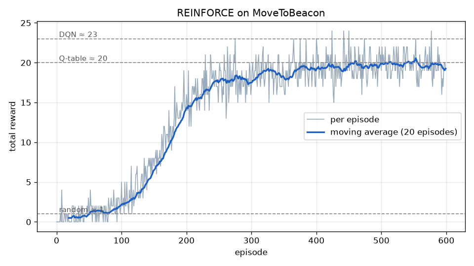
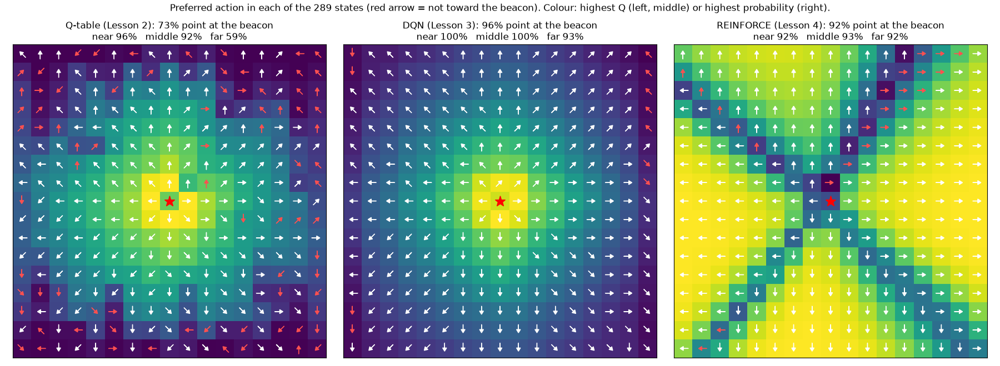

# Lesson 4 — Learning a Policy Directly: REINFORCE

> **Goal:** stop learning values and learn the behaviour itself: a network that outputs
> the probability of each action. Train it with the simplest policy-gradient method,
> REINFORCE, and compare it with Lessons 2 and 3 on the same game.
>
> **You will learn:** stochastic policies, softmax, returns, the policy-gradient update,
> why "log" appears in it, on-policy learning, and why REINFORCE is noisy.
>
> **Time:** about 2 hours. **StarCraft II needed:** yes (from section 8).

> **Warm up first.** Watch the probabilities in Lesson 2's corridor go up and down after
> each episode:
>
> ```bash
> python 04_reinforce/walkthrough.py --stage 1   # one episode, every number printed
> python 04_reinforce/walkthrough.py --stage 2   # 30 episodes
> ```

---

## 1. Where we are

Lessons 2 and 3 were **value-based**: learn $`Q(s, a)`$, then act by picking the largest.
The behaviour was a by-product of the values.

This lesson is **policy-based**: learn the behaviour directly.

```
value-based  (Lessons 2, 3):  state → 8 Q values       [0.44, 0.72, 0.13, ...] → take the largest
policy-based (Lesson 4)    :  state → 8 probabilities  [10%,  70%,  3%,  ...]  → sample one
```

There is no target $`y`$, no Bellman equation and no $`\varepsilon`$ in this lesson. The
whole idea fits in one sentence: **after each episode, make the actions that led to
reward more likely.** Lessons 5 and 6 build on it. PPO, the most widely used RL method
today, is REINFORCE plus two fixes.

---

## 2. A policy network

```math
\pi(a \mid s; \theta) = \frac{e^{z_a}}{\sum_{b} e^{z_b}}, \qquad z = \text{network}(s; \theta) \qquad (1)
```

The network is the same as Lesson 3's: the same input $`(dx/8, dy/8)`$ and the same
2 → 64 → 64 → 8 layers. Only the meaning of the 8 outputs changes. **Softmax** turns
them into probabilities: all positive, adding up to 1. A larger output means a more
likely action (`PolicyNetwork` in [`reinforce.py`](reinforce.py)).

The agent **samples** its action from these probabilities. That is its exploration:
while the policy is unsure (say 30% / 25% / 20% …), it tries many things. As it
becomes sure (90% / 5% …), it settles down. No $`\varepsilon`$ schedule is needed. The log prints
the policy's **entropy**, a measure of how random it is: $`\log 8 = 2.08`$ means uniform
(knows nothing), and 0 means it always does the same thing.

---

## 3. The return

How good was an action? REINFORCE's answer: look at all the reward that came after it
in this episode, discounted as in Lesson 1:

```math
G_t = r_t + \gamma\, r_{t+1} + \gamma^2 r_{t+2} + \dots = r_t + \gamma\, G_{t+1} \qquad (2)
```

It is computed backwards from the end of the episode (`returns` in `reinforce.py`).
As in Lesson 2, reaching a beacon ends a sub-task, so the sum stops there.

Compare Lesson 2's target $`y = r + \gamma \max Q(s')`$. That target **guessed** the future
from $`Q`$ (bootstrapping). $`G_t`$ **waits and sees** what actually happened. So there is
no guess to be wrong about, but REINFORCE can only learn once the episode is over. This
"wait until the end" style is called **Monte Carlo**.

---

## 4. The REINFORCE update

For every step $`t`$ of the episode, push up the log-probability of the action taken, in
proportion to the return that followed:

```math
\theta \leftarrow \theta + \alpha \sum_t G_t \, \nabla_\theta \log \pi(a_t \mid s_t; \theta) \qquad (3)
```

Large $`G_t`$ means a strong push, and $`G_t = 0`$ means no push. Because the probabilities
must add up to 1, pushing one action up pushes the others down.

**Why the log?** $`\nabla \log \pi = \nabla \pi / \pi`$: the push is divided by the action's
probability. An action the policy already takes 90% of the time appears in many
episodes, so it would collect many pushes just by being common. Dividing by $`\pi`$
cancels that, so each action is judged by *how good* it is, not *how often* it was tried.
For softmax this works out to a simple rule: the taken action's preference goes up by
$`\alpha G_t (1 - \pi(a_t))`$, and every other action's goes down by $`\alpha G_t \pi(b)`$.

In code, optimisers *minimise*, so we minimise the negative (`learn` in `reinforce.py`):

```math
L(\theta) = -\frac{1}{T}\sum_t G_t \log \pi(a_t \mid s_t; \theta) \qquad (4)
```

`walkthrough.py --stage 1` does one update by hand. The episode is
`0 → right → 1 → LEFT → 0 → right → 1 → right → 2 → right → B`:

```
G_0 = 0.656  G_1 = 0.729  G_2 = 0.810  G_3 = 0.900  G_4 = 1.000

t=0  cell 0 --right   push right up by 0.5 x 0.656 x 0.50 = 0.164
t=1  cell 1 -- left   push left up by  0.5 x 0.729 x 0.50 = 0.182
t=3  cell 1 --right   push right up by 0.5 x 0.900 x 0.50 = 0.225
...
After one episode:   cell 0: 67.5% right   cell 1: 52.1% right   cell 2: 62.2% right
```

---

## 5. The weakness: noise

Look at `t=1` above. Going **left** in cell 1 was a mistake, yet its probability went
**up**, because the episode still reached the beacon ($`G_1 = 0.729 > 0`$). REINFORCE only
knows "this episode ended well". It cannot tell which steps deserved the credit.

In MoveToBeacon every reward is 0 or +1, so every $`G_t \ge 0`$. **Every action ever taken
gets pushed up.** Good actions get pushed a little more, because they lead to reward
sooner, and learning comes only from that small difference. `walkthrough.py --stage 2`
shows the result. After episode 2, $`\pi(\text{right})`$ in cell 1 was 63.9%. Episode 3
wandered for 9 steps before reaching the beacon, and its detours were rewarded too:

```
  episode  steps   pi(right) in cell 0     cell 1     cell 2
        2      3              59.6%      63.9%      70.6%
        3      9              79.7%      43.7%      76.3%     <- cell 1 dropped
```

It recovers, but only by averaging over many episodes. The cure is to ask "was this
better **than usual**?" instead of "was this good?". That means subtracting an average
(a *baseline*) from $`G_t`$, which is the subject of Lesson 5.

---

## 6. The whole algorithm

```
Initialise the policy network θ randomly
For each episode:
    play the whole episode, sampling a_t ~ π(· | s_t; θ); record (s_t, a_t, r_t)
    compute G_t for every step, backwards                             (Eq. 2)
    one gradient step:  θ ← θ + α Σ_t G_t ∇ log π(a_t | s_t; θ)       (Eq. 3, 4)
    throw the episode away
```

Put it next to Lesson 3's box: no replay buffer, no target network, no $`\varepsilon`$,
one update per **episode** instead of per step. The last line matters. The update in Eq. 3
is only correct for episodes played by the **current** policy, so old episodes cannot be
reused. Learning from your own current behaviour only is called **on-policy**. DQN
could replay old data because Q-learning is off-policy (Lesson 2, section 5).

Settings: Adam with learning rate $`10^{-3}`$, $`\gamma = 0.9`$.

---

## 7. First test: GridWorld

```bash
python 04_reinforce/reinforce.py --env gridworld
```

```
episode  100 | avg reward   0.92 | avg steps   19.4 | entropy 1.16
episode  300 | avg reward   1.00 | avg steps    6.3 | entropy 0.61
episode  600 | avg reward   1.00 | avg steps    5.2 | entropy 0.40
episode 1000 | avg reward   1.00 | avg steps    5.2 | entropy 0.21

Most likely action in each cell:
v v v v v
v v # v v
v v # v v
v v v v v
> > > > B
```

It finds the 5-step shortest path, but it needs about **600 episodes**. Q-learning needed
about 200. With one update per episode and a noisy signal, REINFORCE uses its
experience much less efficiently. Watch the entropy fall as the policy becomes sure
of itself ($`\log 4 = 1.39`$ is uniform for 4 actions).

---

## 8. MoveToBeacon

▶ **Run it** (about 15 minutes):

```bash
python 04_reinforce/reinforce.py --env sc2 --episodes 600
```

```
episode  100 | avg reward   1.90 | avg steps  239.0 | entropy 2.02
episode  200 | avg reward  14.70 | avg steps  239.0 | entropy 1.38
episode  300 | avg reward  17.60 | avg steps  239.0 | entropy 0.85
episode  400 | avg reward  18.80 | avg steps  239.0 | entropy 0.75
episode  500 | avg reward  19.70 | avg steps  239.0 | entropy 0.66
episode  600 | avg reward  18.80 | avg steps  239.0 | entropy 0.66
```



For the first 100 episodes almost nothing happens: the entropy stays near 2.08, and the
marine moves at random. Then it learns quickly and levels off around **20 beacons**.
That is the Q-table's level, below the DQN's 23.

**All three agents, same game, same input:**

```bash
python 04_reinforce/compare.py
```

| | Q-table (L2) | DQN (L3) | REINFORCE (L4) |
|---|---|---|---|
| beacons per episode (end of training) | ~20 | ~23 | ~20 |
| episodes to reach ~20 | ~200 | ~160 | ~400 |
| gradient updates per episode | 240 (one per step) | 240 (batches of 64) | **1** |
| states pointing at the beacon: near / middle / far | 96 / 92 / 59% | 100 / 100 / 93% | 92 / 93 / 92% |



Two things stand out in the right-hand map.

- **It rarely goes diagonally.** Whole regions use one straight direction: "the beacon is
  up and a bit to the right" gets ↑ instead of ↗. The marine still arrives, by walking
  an L-shape or a zig-zag, which takes a few more steps per beacon. That explains most of
  the gap to the DQN. A likely reason: once a direction becomes likely, it is chosen more
  often, and each success pushes it up again. REINFORCE's noisy signal is too weak to pull
  it back toward the slightly better diagonal.
- **The colour means something different.** For Q-maps, the colour is the value:
  bright near the beacon. For a policy, it is the probability of the preferred action,
  its *confidence*. REINFORCE is most confident far away, where "go that way" is
  obviously right, and least sure right next to the beacon. There, small position
  errors inside a 4-pixel cell make the right move ambiguous.

▶ **Watch it:**

```bash
python 04_reinforce/watch_reinforce.py              # sample actions, as in training
python 04_reinforce/watch_reinforce.py --grid       # the 8 probabilities drawn on the game
python 04_reinforce/watch_reinforce.py --greedy     # always the most likely action
python 04_reinforce/watch_reinforce.py --random     # compare with a random marine
```

With `--grid`, the 8 numbers around the marine are probabilities. They add up to 1.

---

## 9. Experiments

1. **Learning rate.** `--lr 1e-2` on GridWorld. Faster? Look at the entropy: how quickly
   does the policy become certain, and does it always become certain of the *right* thing?
2. **Sample or greedy.** Watch with and without `--greedy` a few times. Which scores more?
3. **More episodes.** `--episodes 1200` on MoveToBeacon. Does it catch up with the DQN, or
   stay at about 20 with its straight-line habit?
4. **Seeds.** GridWorld with `--seed 1`, `--seed 2`, `--seed 3`. How much does the number of
   episodes needed vary? Compare the same with Lesson 2's Q-learning.

---

## 10. Questions learners ask

<details>
<summary><b>1. Where did ε go? How does it explore?</b></summary>

The policy is a probability distribution, so the agent explores automatically: an
action with 20% probability is tried one time in five. Exploration fades on its own as the
probabilities sharpen, as the entropy column shows. The risk is the opposite of
$`\varepsilon`$-greedy's. The policy can become confident too early and stop trying
alternatives, like the diagonals here. Lesson 6 adds a small reward for staying
uncertain (an *entropy bonus*) to fight that.
</details>

<details>
<summary><b>2. Should the trained marine sample, or take the most likely action?</b></summary>

Usually either works, and for this run both reach 17–20 beacons. But a deterministic
policy can get stuck in a loop that sampling would escape. In one of our training runs,
the greedy marine bounced forever between "beacon 1 cell left" and "beacon right here"
and scored 7. Sampling from the same network scored 21. A stochastic policy's randomness is
a feature: it is how the agent gets unstuck, and in games against opponents it keeps the
agent unpredictable.
</details>

<details>
<summary><b>3. REINFORCE was slower and scored lower than DQN. Why learn it?</b></summary>

Because policy methods scale where value methods struggle. With a huge or continuous set
of actions (click anywhere on the screen, steer a robot arm), "take the max over all
actions' Q values" becomes impractical. Outputting a distribution does not. And the
noise problem has good fixes. Lesson 5 adds a critic that tells "better than usual" apart
from "good", and Lesson 6 (PPO) keeps each update small and reuses data a few times. Those
two fixes turn this slow learner into the method used for game AI, robotics and training
large language models.
</details>

<details>
<summary><b>4. There are no Q values. How does it know which actions are good?</b></summary>

It never estimates "how good" in numbers. It only sees which episodes turned out well,
and nudges the probabilities of whatever was done in them. The knowledge ends up **in the
probabilities themselves**. The price is noise (section 5). Lesson 5 brings a value
estimate back, as a helper for judging actions rather than as the thing that picks them.
</details>

<details>
<summary><b>5. Why can't REINFORCE use a replay buffer like DQN?</b></summary>

Eq. 3 averages over episodes played by the *current* policy. An episode from 200 updates
ago shows how an older policy behaved. Its actions were chosen with different
probabilities, so pushing on them would push in the wrong proportions. That is
**on-policy** learning. Correcting old data for the change in probabilities is possible,
and that correction (an *importance ratio*) is part of what PPO does.
</details>

---

## 11. Exercises

1. An episode has rewards $`0, 0, 1`$ and $`\gamma = 0.9`$. Compute $`G_0, G_1, G_2`$.
2. A cell has two actions with preferences $`h = (0, 0)`$, so 50% / 50%. The agent takes
   "right" and $`G = 1`$, with $`\alpha = 0.5`$. Using the softmax rule from section 4, what
   are the new preferences and the new $`\pi(\text{right})`$? Compare with cell 2 in
   `walkthrough.py --stage 1`.
3. Suppose every reward in MoveToBeacon were shifted by +10, so each step gives +10 and
   each beacon +11. Which action is best does not change. What happens to the size of every
   $`G_t`$, and to the noise from section 5?
4. REINFORCE made one gradient update per 240-step episode. How many updates had DQN made
   by the time REINFORCE finished its 600 episodes, if DQN had trained just as long?
   (DQN: one update per step, learning starts after 500 steps.)

<details>
<summary>Answers</summary>

1. Backwards: $`G_2 = 1`$, $`G_1 = 0 + 0.9 \times 1 = 0.9`$, $`G_0 = 0 + 0.9 \times 0.9 = 0.81`$.
2. The taken action goes up by $`\alpha G (1 - \pi) = 0.5 \times 1 \times 0.5 = 0.25`$, and the other
   goes down by $`\alpha G \pi = 0.25`$, so $`h = (-0.25, 0.25)`$.
   $`\pi(\text{right}) = e^{0.25} / (e^{0.25} + e^{-0.25}) = 1 / (1 + e^{-0.5}) \approx 62.2\%`$,
   exactly cell 2 after one episode in the walkthrough.
3. Every $`G_t`$ becomes huge (a sum of many +10s), so every action taken gets a big push,
   good or bad. The useful signal (the small difference between good and bad) is
   unchanged, but it is now buried under a much larger shared push. That is far noisier.
   Subtracting a baseline (Lesson 5) removes exactly that shared part.
4. About $`600 \times 240 - 500 \approx 143{,}500`$ updates, each on a batch of 64, against REINFORCE's 600.
   That is the main reason REINFORCE needs more episodes. Lesson 6's PPO narrows the gap by
   taking several updates from each batch of experience.

</details>

---

## Summary

| Idea | Equation | In one line |
|---|---|---|
| policy network | Eq. 1 | softmax turns the network's outputs into action probabilities |
| return | Eq. 2 | $`G_t`$: the discounted reward that actually followed step $`t`$ |
| REINFORCE update | Eq. 3 | push $`\log \pi(a_t \mid s_t)`$ up in proportion to $`G_t`$ |
| loss in code | Eq. 4 | minimise $`-\text{mean}(G_t \log \pi)`$ |
| on-policy | — | learn only from episodes played by the current policy |

**Further reading:** Williams, *Simple statistical gradient-following algorithms for
connectionist reinforcement learning*, 1992 (the REINFORCE paper). Sutton & Barto,
chapter 13 (policy gradient methods).

**Previous:** [← Lesson 3](../03_dqn/) · **Next:** Lesson 5 — Actor and critic (coming soon)
